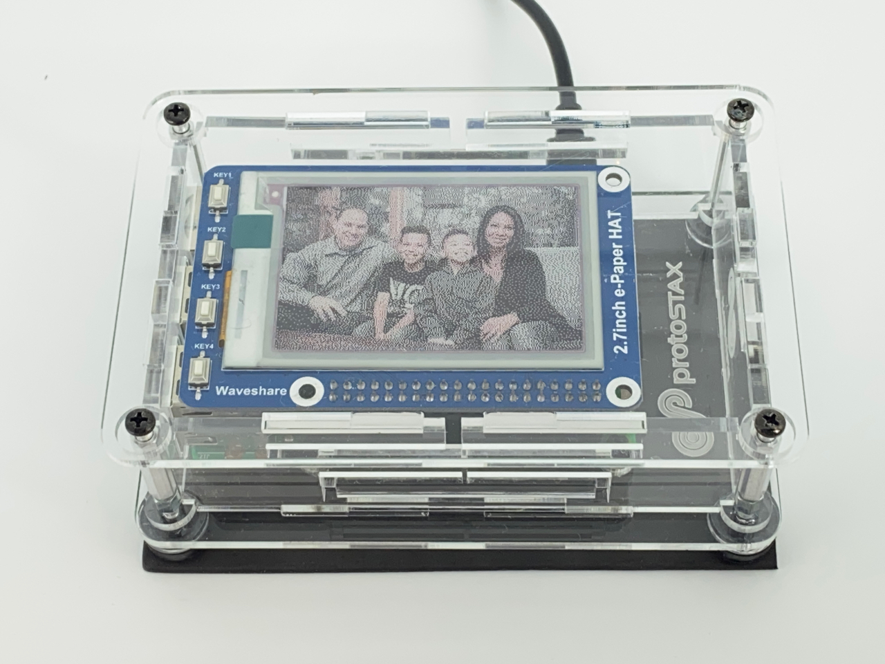

# PhotoStax - Digital ePaper Photo Frame
Make your own minimalist and modern photo frame with a tri-color ePaper Display, Raspberry Pi and ProtoStax Enclosure




using
[ProtoStax for Raspberry Pi B+](https://www.protostax.com/products/protostax-for-raspberry-pi-b)

For further instructions and explanations, see the
[PhotoStax - Digital ePaper Photo Frame](https://www.hackster.io/sridhar-rajagopal/photostax-digital-epaper-photo-frame-84d4ed)
Tutorial at [Hackster.io](https://www.hackster.io/sridhar-rajagopal/photostax-digital-epaper-photo-frame-84d4ed)


## Prerequisites

* Enable SPI on the Raspberry Pi
* Python 3 or higher. The code and the ePaper library assumes you are
  using Python 3 or higher! (with Raspberry Pi OS, the latest is
  Python3.7)
* The following libraries:

**Install spidev, RPi.gpio, Pillow and Wand**
**NOTE - Use sudo pip3!**

```
sudo apt-get install python3-spidev
sudo apt-get install rpi.gpio
sudo apt-get install python3-pil
sudo pip3 install Wand
```


## Installing

This demo uses Waveshare's ePaper libary - see
[https://github.com/waveshare/e-Paper](https://github.com/waveshare/e-Paper)

but includes the necessary files from that library directly with some modifications, so you
**don't need to install anything extra**!

```
git clone https://github.com/protostax/ProtoStax_ePaper_Photo_Frame.git
```

## Usage

```
cd ProtoStax_ePaper_Photo_Frame
```

### Copy your pictures to the pics folder
```
cd pics
```

Copy your pictures to display. The ePaper Display used is a tri-color
display (with white, black and red pixels). With remapping to this
palette and using Floyd Steinberg dithering, you can get a surprising
amount of detail, but the results will vary based on the colors
available. Make sure your images are 4x6 aspect ratio (heightXwidth)
and enjoy experimenting! Portrait photos are usually great and skin
tone is done quite nicely with the red and black pixels.

See the demo at - 


**NOTE - Using Python 3 or higher!**

```
python3 main.py
```

The program will run every 30 seconds, updating the display with the
next image rendered on the ePaper screen from the image files in the pics/ directory


## Running the script as a service

As an alternative, the Python script can be started during boot by creating a service - more info at https://www.raspberrypi.org/documentation/linux/usage/systemd.md

1. Edit photostax.service - adjust the **WorkingDirectory** path
according to where you've installed it:

```
WorkingDirectory=/home/pi/ProtoStax_ePaper_Photo_Frame
```


2. Copy the photostax.service file into /etc/systemd/system as root:

```
sudo cp photostax.service /etc/systemd/system/
```

3. Start the service:
```
sudo systemctl start photostax.service
```

4. Check if the service is running:

```
sudo systemctl status photostax.service
```

The output should be similar to:
```

● photostax.service - PhotoStax
   Loaded: loaded (/etc/systemd/system/photostax.service; disabled; vendor preset: enabled)
   Active: active (running) since Thu 2021-04-15 20:07:46 PDT; 6s ago
 Main PID: 31783 (python3)
    Tasks: 1 (limit: 1939)
   CGroup: /system.slice/photostax.service
           └─31783 /usr/bin/python3 main.py

Apr 15 20:07:46 raspberrypi systemd[1]: Started PhotoStax.

```

5. If the service is running fine, you can enable it and reboot the Raspberry Pi to load it automatically during boot:
```
sudo systemctl enable photostax.service
```

6. To stop the service:
```
sudo systemctl stop photostax.service
```


## License

Written by Sridhar Rajagopal for ProtoStax. BSD license, all text above must be included in any redistribution

A lot of time and effort has gone into providing this and other code. Please support ProtoStax by purchasing products from us!
Also uses the Waveshare ePaper library. Please support Waveshare by purchasing products from them!
